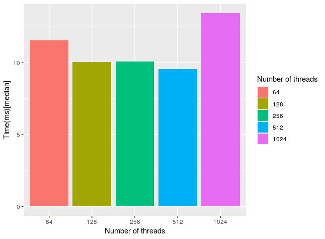
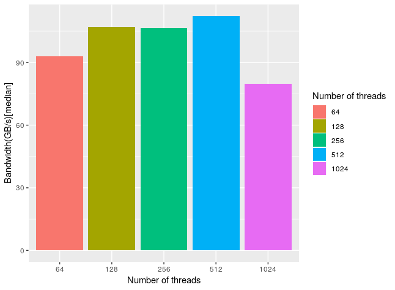
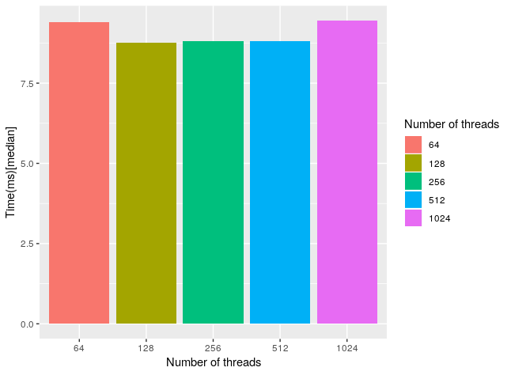
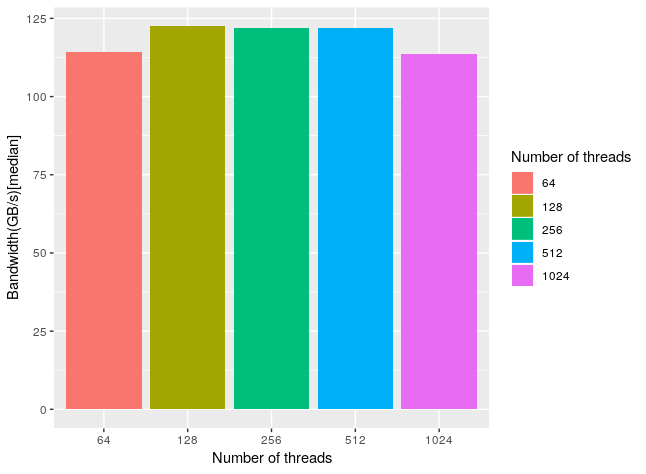

# Fast block transpose using CUDA

The goal of the exercise was to exploit the shared memory of the GPU and implement a block matrix transpose in CUDA. Different sizes for the number of thread were explored, and all the results were compared  with the naive implementation of the algorithm. In this case we have compared the time (in milliseconds) and the bandwidth (in GB/s) [culculated as $\frac{(2*N * N * sizeof(element))} { time(seconds)} $] for a number of threads (i.e. the size of the block) of 64, 128, 256, 512 and 1024, mean, median and variance where calculated on 10 runs for each size. 

The results are summarized in these two plots, here I've chosen the median as a summary because the first iteration was usually slower than the others. However all the complete results are in tabular(csv) form in the files "summary.txt" (summary statistics) and "times.txt" (raw times).

### Times

The median time of the naive algorithm is ~66.4. Here we have a speedup of almost 7

 ### Bandwidth

The median bandwidth for the naive implementation is ~16.1

We can see how block sizes in the middle performs better, with 512 as the fastest choice. It is ,however, important to notice that when dealing with rectangular blocks (ex. 512), higher number of columns performs better (ex. 16 rows * 32 columns seems to be better than 32 rows * 16 columns).   

After reading a paper of Nvidia about optimizing the transpose (http://www.cs.colostate.edu/~cs675/MatrixTranspose.pdf) I have tried to test their optimization and get a sort of "upper bound" on optimization. What is different are some optimization created specifically on the hardware peculiarity of the GPU. The three main further optimization on this code (that you can find under "fast _transpose2.cu", and the data in "summary2.txt and times2.txt") are:

- Use of padding for tile column dimension (in fact the gpu shared memory has (at least in some models) 16 banks such that contiguous words belongs to successive different bank, that can be accessed in parallel by an half warp. So if I have  to access to data 16-strided I end up in the same memory bank and I have to serialize the request)
- They use less thread than the tile size, and let a thread do more than one operation, this works because the overhead of the operation is less than calculate a new set of index for the thread
- Using diagonal indexes (In fact this trick help us to access different partition (6 or 8) of the main memory that can be used in parallel both when reading and writing)

 The result is that their code is  less sensible to change in thread number and overall a ~10 GB/s faste

r comparing the best performance of both the algorithms.

### Nvidia transpose results

